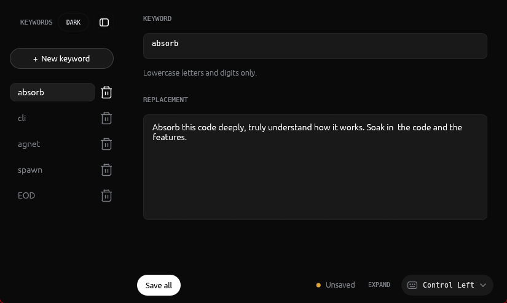
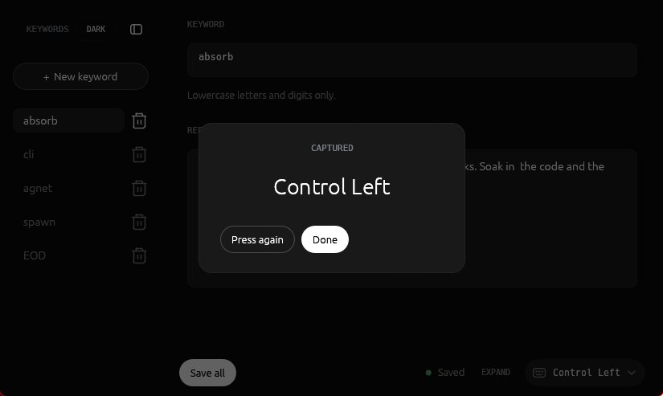
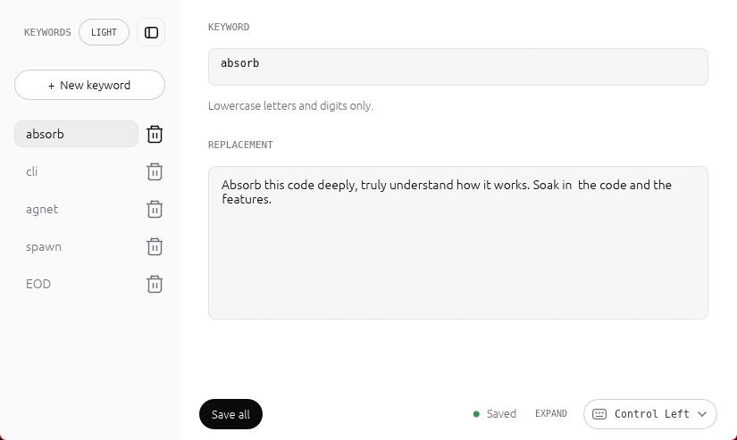

# TextSwitch

**Tiny keywords. Full prompts. Instant flow.**

TextSwitch is a lightweight Windows text expander for people who repeat the same
prompts, snippets, signatures, commands, or paragraphs all day.

Type a short keyword like `uiux`, press your activation key, and TextSwitch
replaces it with the full text you saved. It brings the useful Apple-style text
replacement workflow to Windows, especially for AI prompts and developer
workflows where copy-pasting the same paragraph breaks your focus.

## What It Looks Like

Add a keyword, write the text it should expand into, and choose the key that
triggers replacement.



Pick a custom activation key by pressing it once inside the capture dialog.



The editor also includes a light theme.



## Why TextSwitch Exists

If you work with AI tools, coding agents, support replies, auth flows, UI polish
prompts, or repeated setup instructions, you probably reuse the same long text
every few minutes. The usual options are slow:

- retype the same paragraph
- search through notes
- copy from a saved file
- keep switching windows just to paste one prompt

TextSwitch keeps that flow inside your typing. Save the paragraph once, give it
a small keyword, then expand it anywhere on Windows.

## Install On Windows

1. Download **TextSwitch-Setup.exe** from the
   [latest GitHub release](https://github.com/SAMARTHD30/TextSwitch/releases/latest).
2. Run the installer.
3. Open TextSwitch from the desktop shortcut, Start Menu, or tray icon.
4. Add a keyword like `uiux`.
5. Paste the full prompt or paragraph you want to reuse.
6. Save.
7. In any text box, type `uiux` and press the activation key.

Default activation key: **Right Ctrl**.

The installer:

- installs TextSwitch to `%LOCALAPPDATA%\Programs\TextSwitch`
- creates Start Menu and Desktop shortcuts
- adds TextSwitch to Windows startup in background mode
- registers TextSwitch in Windows Apps & features
- launches the tray app after installation

Because this is an early unsigned build, Windows SmartScreen may show a warning
the first time you run the installer.

## Example

| You type | Press | TextSwitch expands |
| --- | --- | --- |
| `uiux` | `Right Ctrl` | Your full UI quality prompt |
| `authfix` | `Right Ctrl` | Your auth debugging checklist |
| `commitmsg` | `Right Ctrl` | Your commit-message instruction |
| `reply` | `Right Ctrl` | A full support response template |

## Features

- Global Windows text expansion
- Simple keyword-to-paragraph replacement
- Multi-line snippets and prompts
- Tray app that stays out of the way
- Built-in editor for adding and updating keywords
- Custom activation key support
- Hot reload when the config file changes
- Clipboard restore after expansion
- Windows installer for normal users
- Written in Rust

## Custom Activation Key

Open the editor and use **Expand with** to choose the key that triggers
replacement. You can use one of the built-in options or choose
**Custom - press a key...** and press the key you want.

TextSwitch captures custom keys while the app window is active, including keys
like `Tab`, `CapsLock`, `Left Ctrl`, `Left Shift`, and other modifier/system
keys.

## Configuration

TextSwitch stores your snippets here:

```text
%APPDATA%\TextSwitch\triggers.toml
```

Example:

```toml
activation = "right_ctrl"

[[match]]
trigger = "uiux"
replace = """
Act as a senior product designer and frontend engineer.
Improve this UI so it feels polished, responsive, accessible, and production-ready.
Keep the design practical, not decorative, and explain only the meaningful changes.
"""
```

## Trigger Rules

- Triggers use lowercase letters and digits: `a-z`, `0-9`
- Matching is exact
- `uiux` expands only when typed as its own word
- TextSwitch deletes the trigger and pastes the saved replacement in place

## Good Use Cases

- AI prompts you reuse every day
- Coding-agent instructions
- UI review prompts
- Auth/debugging checklists
- Email and support replies
- Code review templates
- Repeated commands or notes
- Personal productivity snippets

## Build From Source

Developers can build the app locally:

```powershell
cargo build --release
```

Run the built app:

```powershell
.\target\release\textswitch.exe
```

Run it in tray-only startup mode:

```powershell
.\target\release\textswitch.exe --background
```

Build the Windows installer:

```powershell
powershell -ExecutionPolicy Bypass -File .\installer\build-installer.ps1
```

The installer is written to:

```text
dist\TextSwitch-Setup.exe
```

## Manual Test Checklist

1. Run `dist\TextSwitch-Setup.exe`.
2. Confirm TextSwitch installs under `%LOCALAPPDATA%\Programs\TextSwitch`.
3. Confirm Start Menu, Desktop, and startup shortcuts are created.
4. Confirm TextSwitch appears in Windows Apps & features.
5. Confirm the tray icon appears after installation.
6. Open the editor from the tray.
7. Add a keyword and multi-line replacement.
8. Save.
9. Open Notepad or any text box.
10. Type the keyword and press the activation key.
11. Confirm the keyword is replaced by the full saved text.
12. Change the activation key and test again.
13. Uninstall from Windows Apps & features.

## Limitations

- Windows only
- Static text only for now
- No dynamic tokens like `{date}` or `{clipboard}` yet
- Triggers are currently limited to lowercase letters and digits
- Installer is unsigned

## Status

TextSwitch is an early personal productivity tool built to make repeated writing
and AI prompt workflows faster on Windows.
